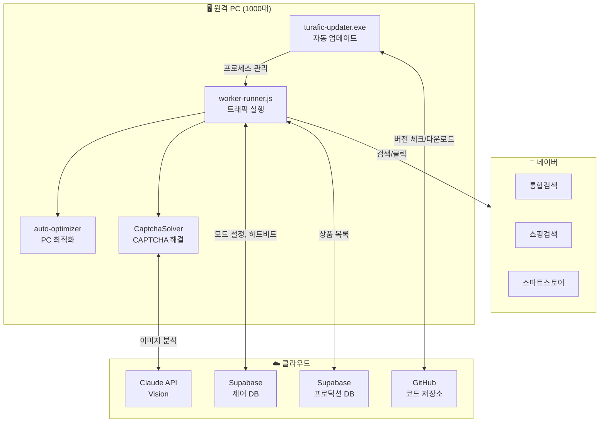
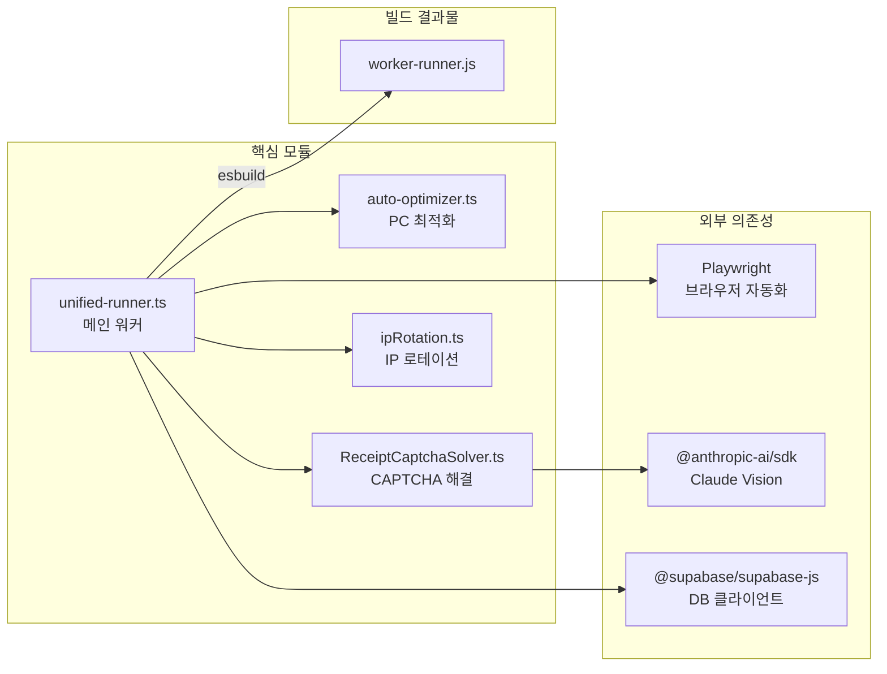
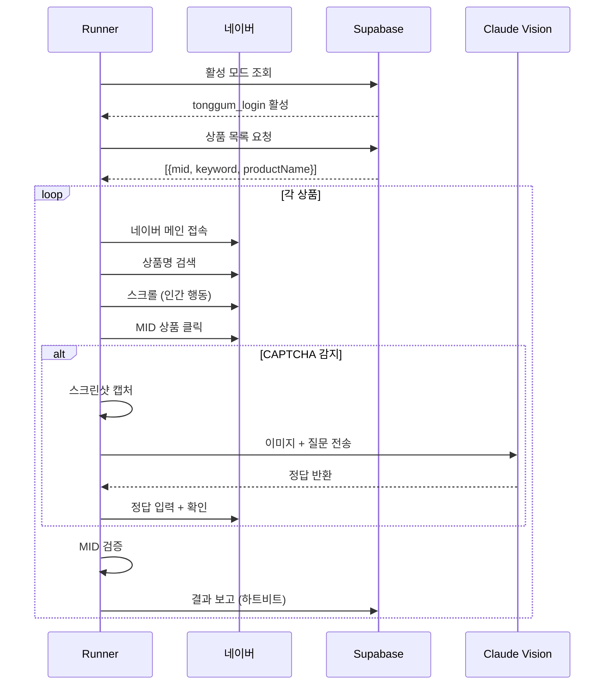
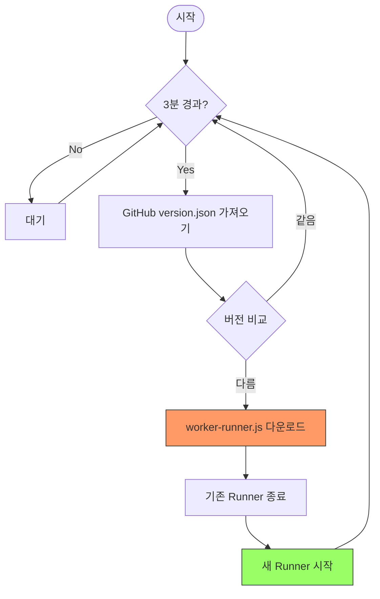
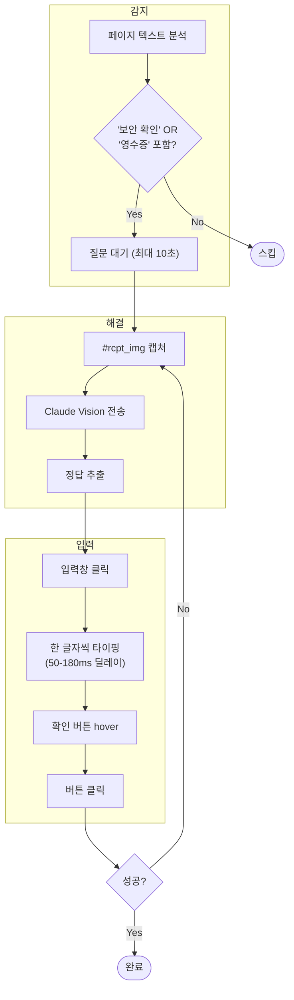
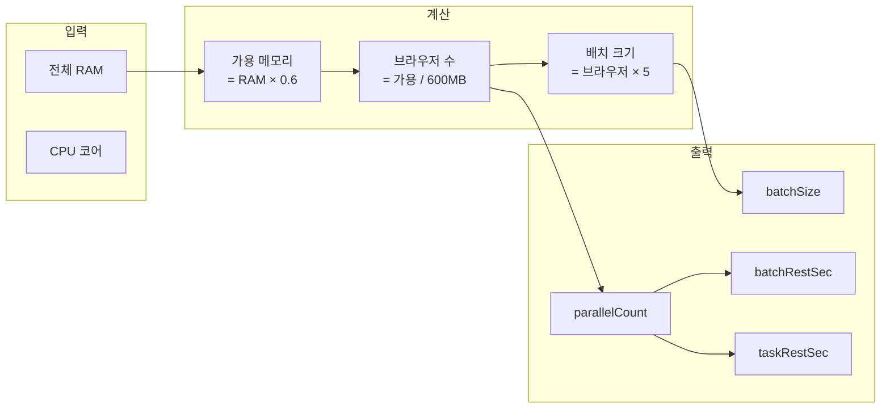

# TURAFIC Update - 시스템 아키텍처

> 원격 PC 자동 배포 및 네이버 트래픽 자동화 시스템

---

## 1. 전체 시스템 구조



---

## 2. 모듈 의존성



---

## 3. 트래픽 실행 흐름



---

## 4. 자동 업데이트 흐름



---

## 5. CAPTCHA 해결 흐름



---

## 6. PC 최적화 계산



---

## 7. 파일 구조

```
turafic_update/
├── 📦 배포 파일
│   ├── turafic-updater.exe    # 원격 PC 실행 파일
│   ├── worker-runner.js       # 트래픽 워커 (빌드 결과)
│   └── version.json           # 버전 정보
│
├── 🔧 핵심 모듈
│   ├── unified-runner.ts      # 메인 트래픽 엔진
│   ├── auto-optimizer.ts      # PC 최적화
│   ├── ReceiptCaptchaSolver.ts # CAPTCHA 해결
│   ├── ipRotation.ts          # IP 로테이션
│   └── auto-updater.ts        # 자동 업데이트
│
├── 🧪 테스트/디버그
│   ├── test-captcha-local.ts  # CAPTCHA 로컬 테스트
│   ├── test-captcha-prb.ts    # PRB 버전 테스트
│   └── debug-captcha-*.ts     # 디버그 스크립트
│
├── ⚙️ 설정
│   ├── config.ts              # 전역 설정
│   ├── .env                   # 환경변수 (비밀)
│   └── package.json           # 의존성
│
└── 📚 문서
    ├── README.md              # 설치 가이드
    ├── MODULES.md             # 모듈 설명
    └── ARCHITECTURE.md        # 이 문서
```

---

## 8. 환경변수

| 변수 | 설명 | 필수 |
|------|------|:----:|
| `NODE_ID` | 워커 식별자 (예: worker-pc-001) | ✅ |
| `SUPABASE_CONTROL_URL` | 제어 DB URL | ✅ |
| `SUPABASE_CONTROL_KEY` | 제어 DB API 키 | ✅ |
| `SUPABASE_PRODUCTION_URL` | 프로덕션 DB URL | ✅ |
| `SUPABASE_PRODUCTION_KEY` | 프로덕션 DB API 키 | ✅ |
| `ANTHROPIC_API_KEY` | Claude Vision API 키 | ⚠️ CAPTCHA용 |
| `PARALLEL_COUNT` | 병렬 수 (오버라이드) | ❌ |
| `BATCH_SIZE` | 배치 크기 (오버라이드) | ❌ |

---

## 9. 데이터베이스 테이블

### Control DB (navertrafictest)
```sql
-- 트래픽 모드 설정
traffic_mode_settings (
  mode_type: 'tonggum_login' | 'tonggum_nologin' | ...
  enabled: boolean
)

-- 워커 노드 관리
workerNodes (
  node_id: string
  status: 'online' | 'offline'
  last_heartbeat: timestamp
  current_version: string
)
```

### Production DB (adpang_production)
```sql
-- 상품 목록
traffic_navershopping (
  id: number
  keyword: string
  mid: string
  product_name: string
  link_url: string
)
```

---

## 10. 빌드 & 배포

```bash
# 1. 워커 빌드
npm run build:worker
# → worker-runner.js 생성

# 2. 버전 업데이트
# version.json의 version 값 수정

# 3. GitHub 푸시
git add worker-runner.js version.json
git commit -m "feat: 새 기능"
git push

# → 원격 PC가 3분 내 자동 업데이트
```
